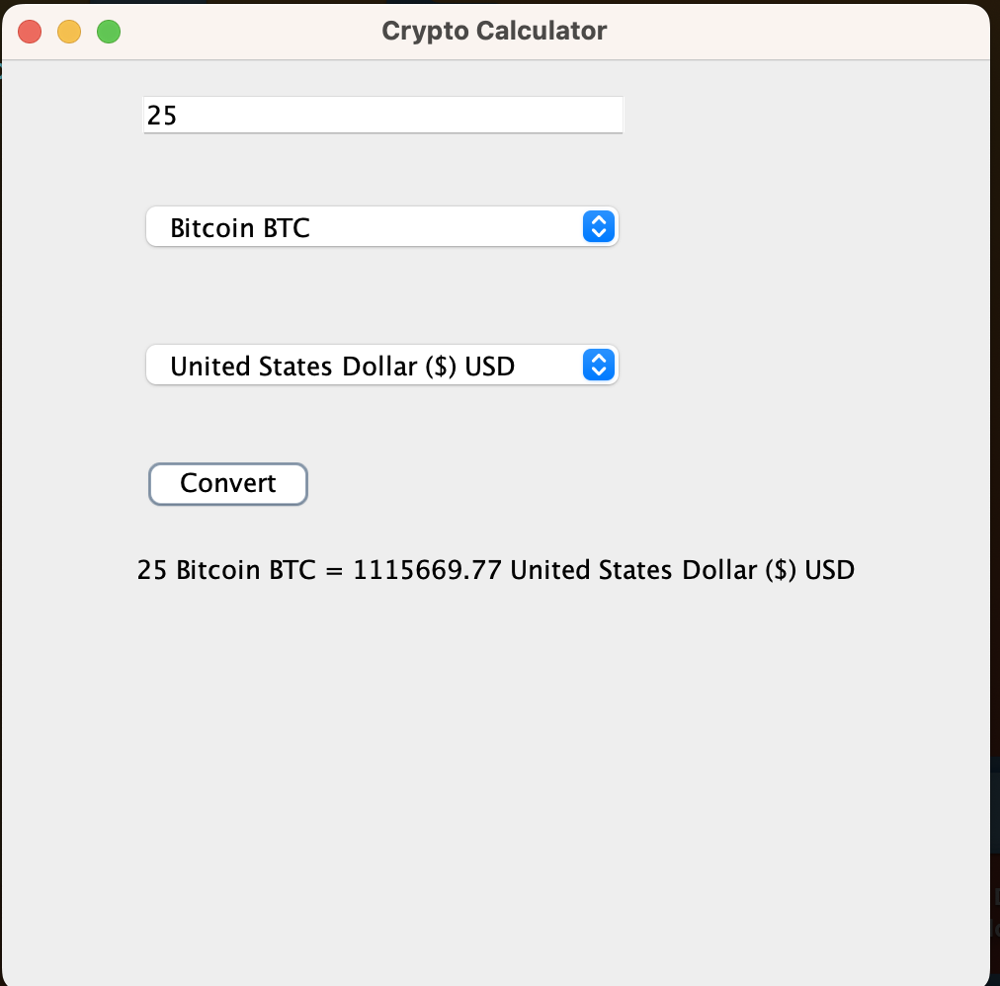

### Crypto Calculator

- Create an assets folder

- Add env (no dot) to the assets folder

- API_KEY=`<Paste your API KEY>`

- Sign up for an account to get a free API key from https://coinmarketcap.com/api

- Launch App

    - mvn clean compile
    - mvn exec:java

